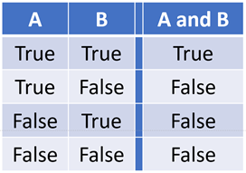
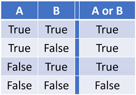
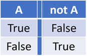
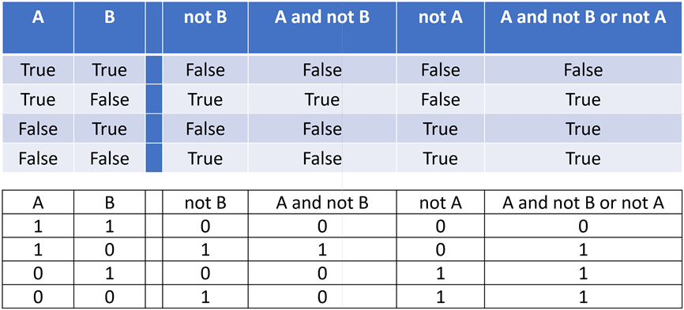
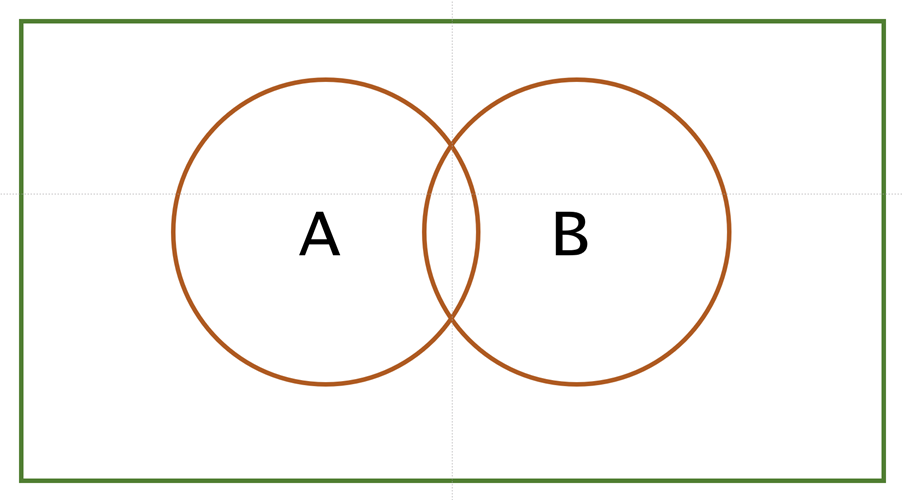

# Practice Worksheet: if, while & Boolean algebra

Here are some practice exercises for you to try. Do attempt them yourself before copy & pasting the code so
that you get maximum benefit from your time.

There are many other learning and practice resources for Python on the web, often free to use.  
Examples are www.snakify.org , www.w3schools.com , www.freecodecamp.org and www.realpython.com.  
Please do make use of them

## Section – if

### Part 1

You can type 'if' statements directly into IDLE and execute them. Try this:

```
>>> if 'three' > 'four':
        print(" 'three' > 'four' ")
``` 

```
>>> if 'three' > 'four':
        print(" 'three' > 'four' ")
```

That's great for trying-things-out, but usually you will want to save your work in a script, or better
still, generalise the algorithm and wrap it into a reusable function.  
Create and test these functions in a python file named if_examples.py

```python
def my_max_v1(a, b):
    """my first version of the built in max() function """
    if a > b:
        return a
    if b >= a:
        return b


def my_max_v2(a, b):
    """my second version of the built in max() function """
    if a > b:
        return a
    return b


def my_max_v3(a, b):
    """my third version of the built in max() function
    ### This executes OK but is FAULTY ### - what's wrong with it?"""
    if a > b:
        result = a
    result = b
    return result


my_max = my_max_v2  # is this the best choice?
```

Test these functions work with values such as (3,4), (‘three’,‘four), etc.

**Task:** Design, write and test a function 'my_min()' that takes two parameter values and the duplicates
the built_in function min()

Here are few more functions using 'if' to practice with:

``` python 
def grade_v1(mark):
    """ Pass or Fail? """
    if mark > 60:
        return 'Pass'
    return 'Fail'

def weather_v1(a_str):
    """ take umbrella? """
    if 'rain' in a_str:
        return 'Take umbrella'

def weather_v2(a_str):
    """ rain or shine? """
    if 'rain' in a_str:
        return 'Take umbrella'
    if 'sun' in a_str:
        return 'Take sunscreen'
    return 'Look outside and guess'

def exec_decider(deadline_today=True):
    if deadline_today:
        return 'Do it now!'
    return 'Mañana'
```

The above functions are easy to copy & paste so check you know what each statement is doing. Execute your
script in Python IDLE then test your functions to make sure they work as anticipated. Is the result they
give what you expected?

``` python 
>>>
>>> my_max( 'three' > 'four')
?
>>> my_max(3, 4)
?
```

## Section – else

The 'else' statement catches the other option to the 'if' statement. Here's an example

``` python 
# A simple grading structure
def grade_v2(mark):
    """ Pass or Fail? """
    if mark > 40:
        return 'Pass'
    else:
        return 'Fail'
```

## Section - elif

``` python 
# More grades mean's more if's, and deeper nesting
def grade_v3(mark):
   """Using if-else. Imagine if there were ten grade options, or more.
   This nesting could get very deep and, if combined with other conditions,
   very difficult to fathom."""
    if student_mark > 90:
        grade = 'A'
    else:
        if student_mark > 80:
            grade = 'B'
        else:
            if student_mark > 60:
                grade = 'C'
            else:
                if student_mark > 40:
                    grade = 'D'
                else:
                   grade = 'oh deary, deary me'


# elif simplifies things 
def grade_v4(mark):
    "Using if-elif-else the code is much neater and easier to read"""
    if student_mark > 90:
        grade = 'Starship Captain'
    elif student_mark > 80:
        grade = 'Astronaut'
    elif student_mark > 60:
        grade = 'Aeronaut'
    elif student_mark > 40:
        grade = 'Earthling'
    else:
        grade = 'Oh deary, deary me'
```

## Section – Boolean Algebra

Evaluate these Boolean equations on paper first, then confirm your deductions by executing them in IDLE:

``` python
>>> a = True
>>> b = True
>>> a and b
>>> a or b
>>> not a and b
>>> not a or b
>>> not not not not a
>>> a and not a
>>> a or not a 
```

## Section - Truth Tables and Venn Diagrams

These can be helpful when evaluating Boolean expressions in 'if' statements and elsewhere. This section is
not directly assessed but both are very handy tools when you need them. For instance, the truth value of
this expression is not immediately apparent:

``` python
(a or not b) and (not b or not a) or (b and not a)
```

It is good practice to design your code so that Boolean conditions are individually simple.

### Truth Tables

#### AND truth table



#### OR truth table



#### NOT truth table



#### Example truth Table: A and not B or not A



### Venn Diagrams

These are a simple way of representing the boolean condition



## Section – while statements

The while statement enables us to repeat a block of code until a condition is satisfied. Try these examples:

``` python
    def counting(upto = 10):
        counter = 0
        # repeat this while block until 'upto' exceeds 'counter'
        while counter < upto:
            print(counter)
            counter = counter + 1
        return
    # end of indented code marks end of while loop
```

Print just the vowels and spaces in a string:

``` python
    def print_vowels(a_str):
        a_str = 'the quick brown fox jumps over the lazy dog'
        vowels = 'aeiou '  # note the space at end of string
        index = 0		
        # repeat while index is less than string length
        while index < len(a_str):
            if a_str[index] in vowels:
                print(a_str[index], end = ' ')
            else:
                print('_', end = '')
            index = index + 1]
```

Printing the characters of the ASCII alphabet:

```python 
    def alphabet_v1():
        char_code = ord('a')  # gets the code for 'a'
        stop = char_code + 26  # the cosecutive letters of the alphabet
        while char_code <= stop:
            print(chr(char_code), end = '')
            char_code = char_code + 1
```

### A short diversion to Unicode. www.unicode.org

Unicode is a very successful attempt to
represent [every character of every language](www.unicode.org/charts/) in a form that can be represented and
manipulated in a computer. It also now
includes [emoji](https://www.unicode.org/emoji/charts/emoji-list.html).

The examples below print the character sets for Arabic, Bengali, and Ancient Egyptian Hieroglyphs. You can
find the codes for many other character sets at www.unicode.org/charts/ . NOTE: the code numbers for the
Unicode characters is a [HEXADECIMAL](https://en.wikipedia.org/wiki/Hexadecimal) (base 16) number and not a
more familiar denary (base 10) number. That is a number to base 16 rather than the usual base 10. Python
understands hexadecimal numbers provided they are prefixed by '0x'. That means that the hexadecimal number
9e (158 denary, 10011110 binary) is written 0x9e in Python.

``` python 
def chars_arabic():
    print('Arabic character set (unicode 0600-06ff)')
    code = 0x0600
    stop = 0x06ff
    while code < stop:
        print(chr(code), end=' ')
        code = code + 1
        if code % 32 == 0:
            print()

def chars_bengali():
    print('Bengali character set (unicode 0980—09FF) ')
    code = 0x0980
    stop = 0x09ff
    while code < stop:
        print(chr(code), end=' ')
        code = code + 1
        if code % 32 == 0:
            print()


def chars_hieroglyphs():
    print('Egyptian Hieroglyphs character set (unicode  Range: 13000—1342F , 1072 characters)')
    code = 0x13000
    stop = 0x1342F
    while code < stop:
        print(chr(code), end=' ')
        code = code + 1
        if code % 32 == 0:
            print()

```

Find a character set for your language of choice and write a 'while' routine to print them out.
(Not every character set will have the been installed on Your PC will almost certainly not have all the
fonts for all thee unicode character sets installed. If the font is missing you will probably get a list of
small empty rectangles printing instead.  
See the Unicode documentation.

## Practice Problems for you to solve

Write a function that takes an integer as it's parameter and does the following:

1. Print all the squares of integer numbers where the square is less than or equal to N, in ascending order.

Write functions that take a string parameter and does the following:

2. Returns the count of the number of vowels
3. Returns the count of the number of spaces
4. Returns the count of the number of upper case letters
5. Encodes and returns the string using the caesar cifer (replace every letter with the letter three places
   further up the alphabet, loop back to 'a' after 'z' if necessary)
6. Decodes and returns the string assuming it was previously encoded using the caesar cipher
7. Returns the number of double-letter pairs there are in the string e.g. 'ee' or 'ss' of 'll'
8. Returns the number of times two consecutive vowels occur

## Section – more practice

Go to www.w3schools.com and work through the functions tutorial and tests
https://www.w3schools.com/python/python_functions.asp  
By now you should be familiar with most of the content within the following sections of W3Schools:
https://www.w3schools.com/python/python_comments.asp  
https://www.w3schools.com/python/python_variables.asp  
https://www.w3schools.com/python/python_numbers.asp  
https://www.w3schools.com/python/python_casting.asp  
https://www.w3schools.com/python/python_strings.asp  
https://www.w3schools.com/python/python_booleans.asp  
https://www.w3schools.com/python/python_operators.asp  
https://www.w3schools.com/python/python_functions.asp  
